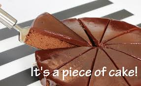

### 連想

take「取る」 + after「後ろ」＝ 後ろを取る ⇒ 跡取り ⇒ ～に似ている

### 類義語
- take after
  - 基本的に「血縁関係のある人」にしか使わない
  - 外見よりも性格や行動、才能などの内面が似ているときに使う
- look like
  - 「血縁関係がない第三者」や「もの」にも使える
  - take after とは逆に「外見」に焦点を当てた「似ている」
- be similar to
  - 人やものだけでなく、考え方や状況などにも使える
  - 似ている部分が「完全に一致」というよりも「部分的に似ている」ニュアンスで使われる
- resemble
  - オールマイティに「～に似ている」
  - もっともフォーマルな表現

### イメージ

