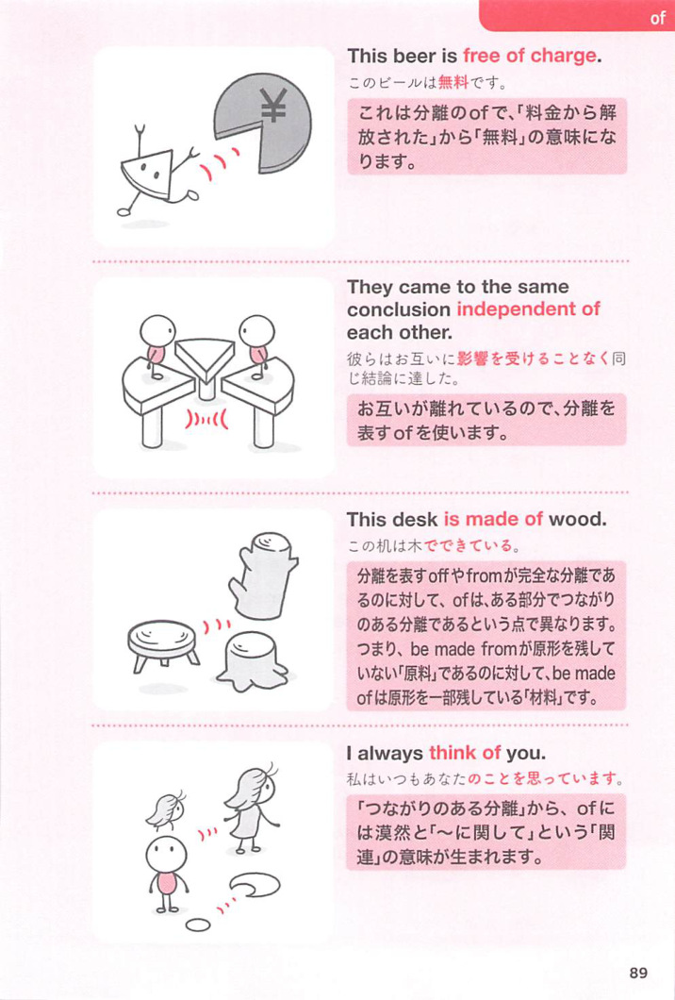

### 連想

complain は「不満や苦痛を声に出す」。complain of/about ~ は「〜について不快さを訴える」⇒ 苦痛を訴える、不平を言う、というイメージ。

### 類義語
- complain of
  - 痛みや症状などを「訴える」ときに使いやすい
  - 医療・説明文でよく見る
- complain about
  - 物事について「不平を言う」
  - 日常会話で使いやすい
- protest
  - 「抗議する」
  - 不満を公に強く示す感じがある
- grumble about
  - 「ぶつぶつ不平を言う」
  - 小さな不満を口にする感じ

### 画像
<!-- 熟語に対応する画像 -->

<!-- 前置詞に対応する画像 -->

