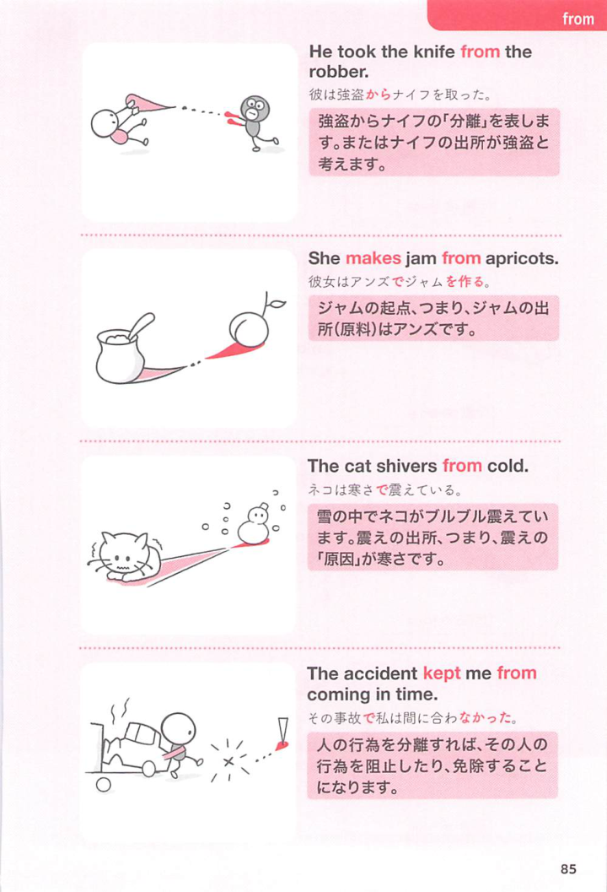

### 連想

suffer は「苦しむ」。suffer from ~ は「〜を原因として苦しみの状態にある」⇒ 病気などで苦しむ、悩む、というイメージ。

### 類義語
- suffer from
  - 病気、痛み、問題、悪影響などで苦しむことを表す
  - 長く続く症状や困難に使いやすい
- have
  - 病気や症状を「持っている」
  - suffer from より中立的で軽い
- be troubled by
  - 「〜に悩まされている」
  - 問題や症状が迷惑をかけている感じ
- struggle with
  - 「〜に苦労する」
  - 病気だけでなく課題や感情にも使える

### 画像
<!-- 熟語に対応する画像 -->

<!-- 前置詞に対応する画像 -->

