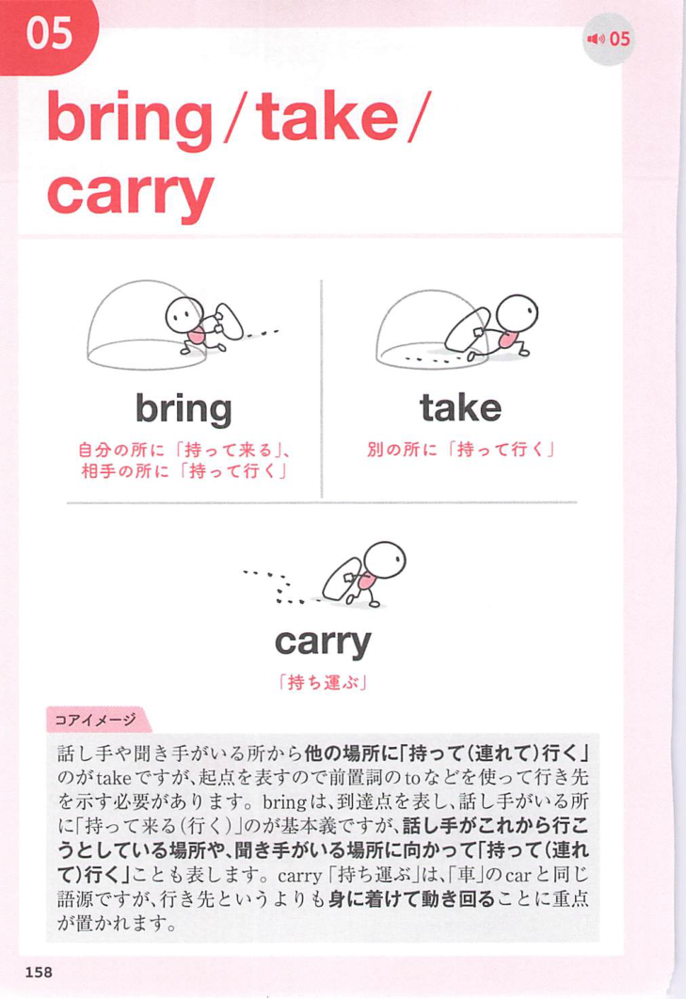

### 連想

bring は「持ってくる」、about は「起こる方向」。bring about ~ は「ある状態をこちらへ起こして持ってくる」⇒ 〜を引き起こす、というイメージ。

### 類義語
- bring about
  - 変化、結果、出来事を引き起こすことを表す
  - 社会的・大きめの変化にも使いやすい
- cause
  - 「〜を引き起こす」の一般的な語
  - 原因を直接示す
- lead to
  - 「〜につながる」
  - 原因から結果への流れを表す
- result in
  - 「結果として〜になる」
  - 結果に焦点がある

### 画像
<!-- 熟語に対応する画像 -->

<!-- 動詞に対応する画像 -->

<!-- 前置詞に対応する画像 -->

