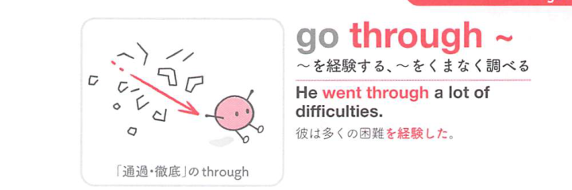
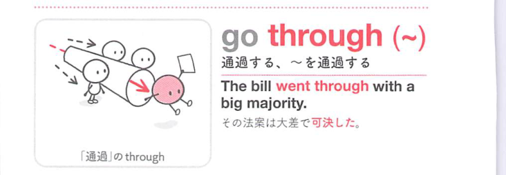
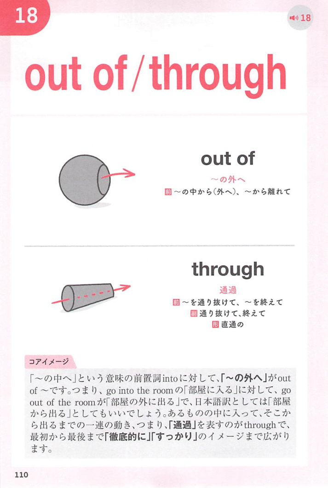
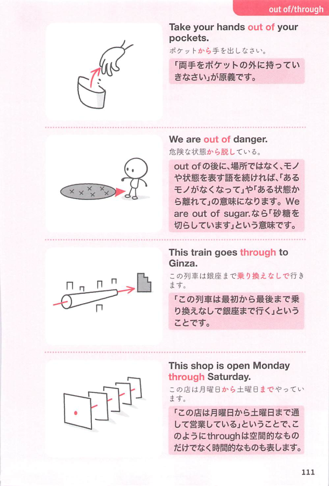

### 連想

go through ~ は「〜を通って向こう側へ行く」イメージ。場所を通過するだけでなく、困難な経験を通り抜ける ⇒ 苦しみなどを経験する、となる。

### 類義語
- go through
  - 場所を通過する、または困難・手続き・経験を経ることを表す
  - 長く大変な過程を感じさせる
- get through
  - 「通り抜ける、やり終える、乗り切る」
  - 終点まで到達する感じが強い
- experience
  - 「経験する」
  - 中立的で、良いことにも悪いことにも使える
- undergo
  - 「経験する、受ける」
  - 治療・変化・試練などに使う硬めの語

### 画像
<!-- 熟語に対応する画像 -->

<!-- 動詞に対応する画像 -->

<!-- 前置詞に対応する画像 -->

