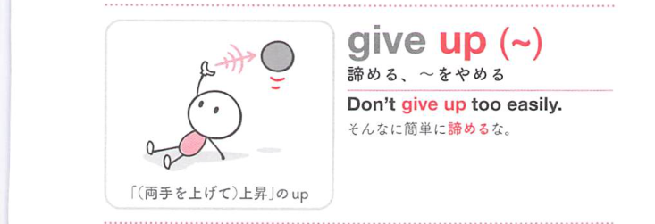
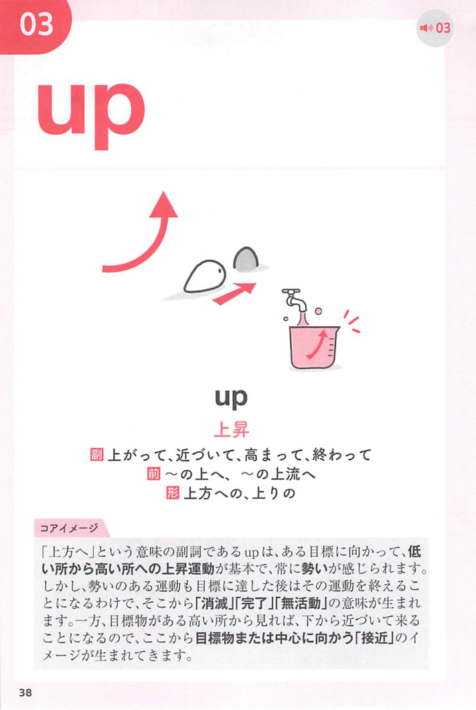
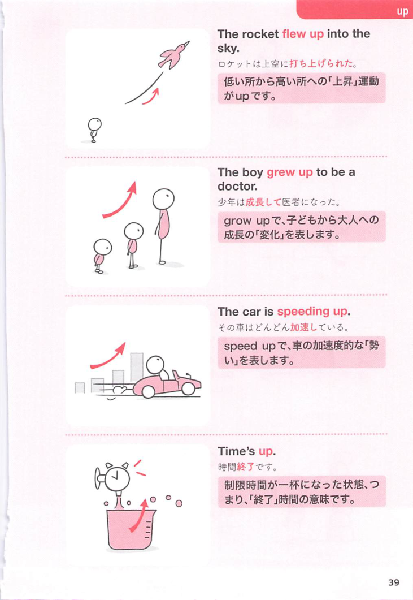

### 連想

give up ~ は「持っているものを上へ差し出して手放す」イメージ。握っていた考えや習慣を手放す ⇒ あきらめる、捨てる、やめる、となる。

### 類義語
- give up
  - 目標をあきらめる、習慣や権利を手放すことを表す
  - 幅広く使える日常表現
- quit
  - 「やめる」
  - 仕事、習慣、活動を中止する感じ
- abandon
  - 「放棄する」
  - give up より硬く、完全に捨てる感じが強い
- stop doing
  - 「〜するのをやめる」
  - 行動の停止を直接表す

### 画像
<!-- 熟語に対応する画像 -->

<!-- 動詞に対応する画像 -->

<!-- 前置詞に対応する画像 -->

