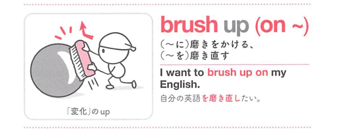

### 連想

brush は「磨く」。brush up on ~ は「一度身につけたものをもう一度磨き直す」⇒ 語学などをやり直して磨きをかける、というイメージ。

### 類義語
- brush up on
  - 以前学んだ知識や技能を復習して磨き直すことを表す
  - 語学、数学、技能などに使いやすい
- review
  - 「復習する、見直す」
  - brush up on より中立的
- refresh
  - 「記憶や知識を新たにする」
  - 忘れかけたものを思い出す感じ
- improve
  - 「向上させる」
  - 以前やったものを磨き直すとは限らない

### 画像
<!-- 熟語に対応する画像 -->

<!-- 前置詞に対応する画像 -->

