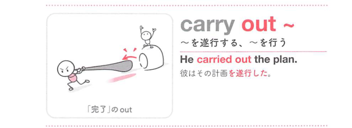

### 連想

carry out ~ は「外へ運び出して実行に移す」イメージ。計画や命令を頭の中で終わらせず、実際に行う ⇒ 〜を実行する、となる。

### 類義語
- carry out
  - 計画、実験、命令、調査などを実行することを表す
  - 予定されたことを実際に行う感じが強い
- perform
  - 「行う、実施する」
  - 仕事・手術・演技などに使える少し硬い語
- conduct
  - 「実施する」
  - 調査、実験、会議などを組織的に行う
- execute
  - 「実行する」
  - 計画や命令を正確に遂行する硬めの表現

### 画像
<!-- 熟語に対応する画像 -->

<!-- 動詞に対応する画像 -->

<!-- 前置詞に対応する画像 -->

