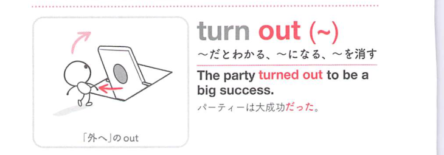
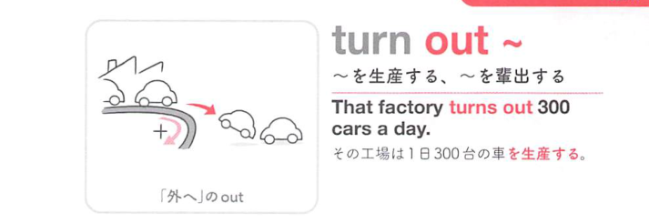
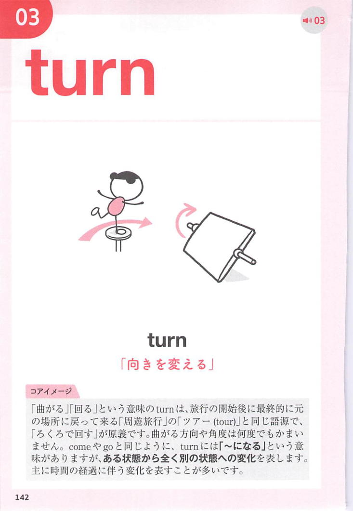
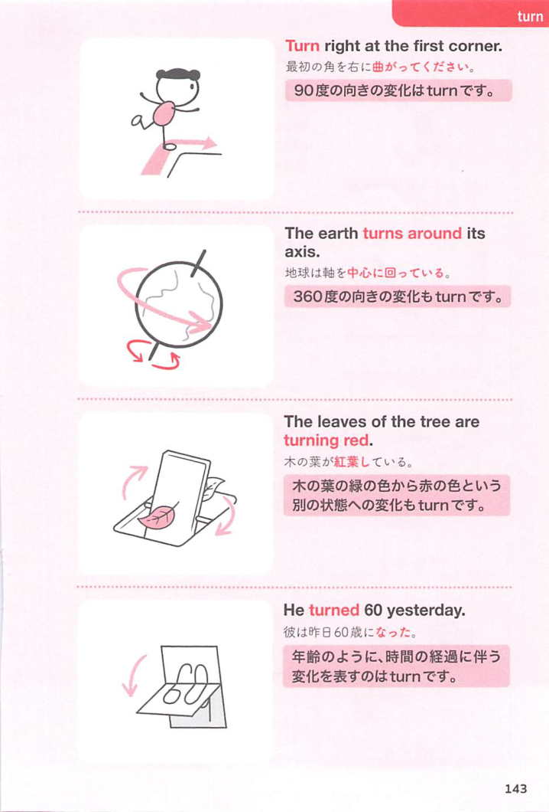

### 連想

turn out は「外へ向いて姿を現す」イメージ。隠れていた結果が外に出る ⇒ 〜であることがわかる、結果的に〜になる、となる。

### 類義語
- turn out
  - 後になって結果や事実がわかることを表す
  - 「産出する」「催しに出かける」の意味も文脈で出る
- prove
  - 「〜であると判明する」
  - turn out より硬く、証明・結果の感じが強い
- end up
  - 「結局〜になる」
  - 予想外の最終結果に焦点がある
- produce
  - 「産出する」
  - turn out の製造・産出の意味に近い

### 画像
<!-- 熟語に対応する画像 -->

<!-- 動詞に対応する画像 -->

<!-- 前置詞に対応する画像 -->

