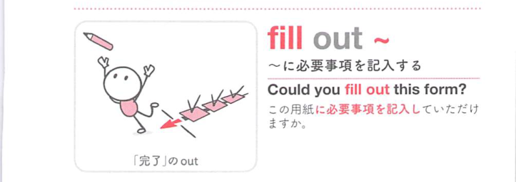

### 連想

fill out ~ は「空欄を外までいっぱいにする」イメージ。書類の空欄を埋める ⇒ 書類などに書き込む、となる。

### 類義語
- fill out
  - 書類や申込用紙の空欄を記入することを表す
  - 主に米語でよく使う
- fill in
  - 「記入する、空所を埋める」
  - 英語圏によっては fill out とほぼ同じ
- complete
  - 「完成させる、記入を終える」
  - 書類を最後まで仕上げることに焦点がある
- write down
  - 「書き留める」
  - 書類全体を記入する意味とは限らない

### 画像
<!-- 熟語に対応する画像 -->

<!-- 前置詞に対応する画像 -->

