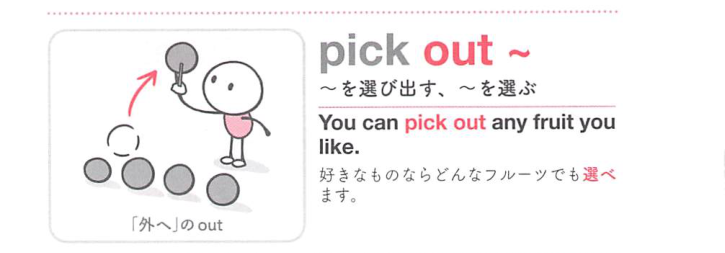
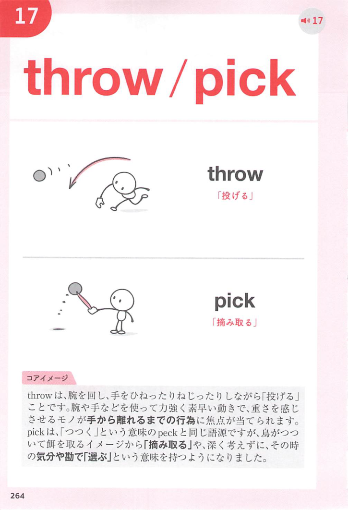
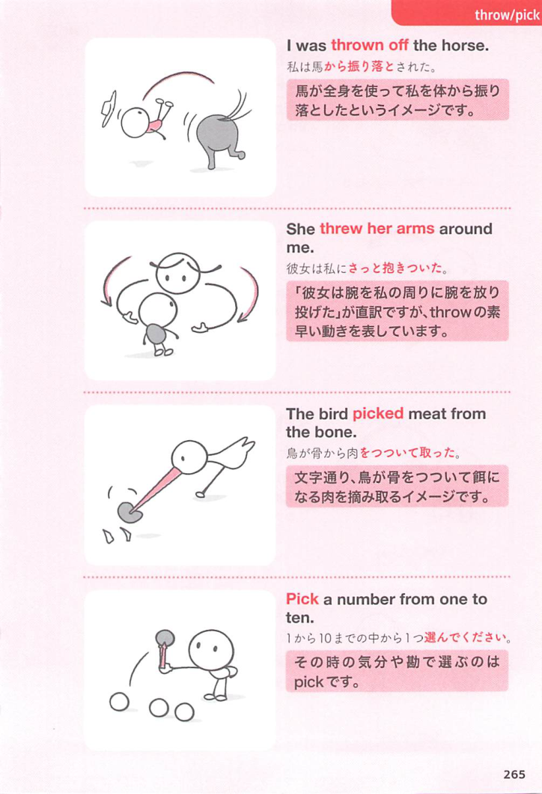

### 連想

pick out ~ は「多くの中から外へつまみ出す」イメージ。候補の中から1つを取り出す ⇒ 〜を選ぶ、となる。

### 類義語
- pick out
  - 複数の中から選び出すことを表す
  - 見分けて取り出す感じもある
- choose
  - 「選ぶ」の最も一般的な語
  - pick out より幅広く使える
- select
  - 「選抜する、選ぶ」
  - choose より少し硬く、基準に従って選ぶ感じ
- single out
  - 「1つだけ選び出す、特に取り上げる」
  - 目立たせて取り出す感じが強い

### 画像
<!-- 熟語に対応する画像 -->

<!-- 動詞に対応する画像 -->

<!-- 前置詞に対応する画像 -->

