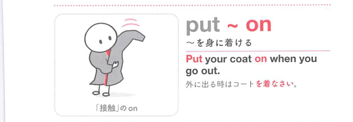
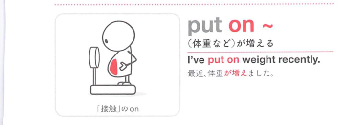
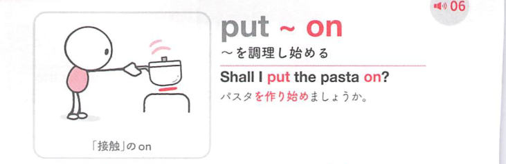

### 連想

put on ~ は「身の上や表面に置く」イメージ。服を体に置く ⇒ 身につける。スイッチを入れて作動状態に置く ⇒ 電気器具などをつける、となる。

### 類義語
- put on
  - 服・靴・帽子などを身につける、または機器をつけることを表す
  - 動作に焦点がある
- wear
  - 「身につけている」
  - 着る動作ではなく、着ている状態を表す
- turn on
  - 「スイッチを入れる」
  - 電気・水・ガスなどを作動させる意味で使う
- switch on
  - 「スイッチを入れる」
  - turn on と近いが、スイッチ操作の感じが明確

### 画像
<!-- 熟語に対応する画像 -->

<!-- 動詞に対応する画像 -->

<!-- 前置詞に対応する画像 -->

