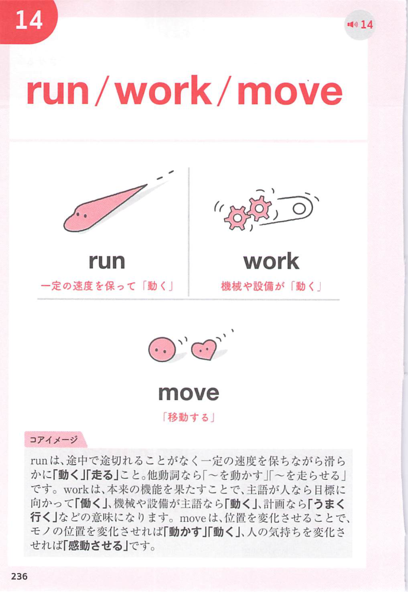
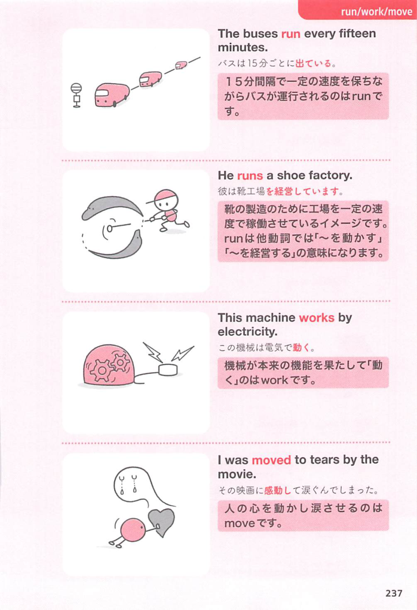

### 連想

work on ~ は「〜の上で働き続ける」イメージ。対象に手をかけて作業する ⇒ 〜に取り組む。薬などが対象に働く ⇒ 〜に効く、という意味にもなる。

### 類義語
- work on
  - 課題、作品、問題などに取り組むことを表す
  - 影響を与える、薬が効くという意味にもなる
- work at
  - 「努力して取り組む」
  - 技能や改善に継続的に努力する感じ
- deal with
  - 「〜を扱う、処理する」
  - 問題対応に焦点がある
- affect
  - 「影響を与える」
  - work on の影響する意味に近い

### 画像
<!-- 熟語に対応する画像 -->

<!-- 動詞に対応する画像 -->

<!-- 前置詞に対応する画像 -->

