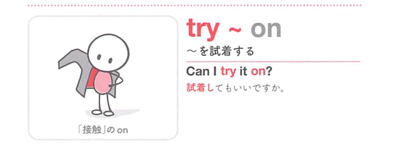

### 連想

try on ~ は「身につけて試す」イメージ。服や靴を実際に着て合うか見る ⇒ 〜を試着する、となる。

### 類義語
- try on
  - 服、靴、帽子などを試しに身につけることを表す
  - サイズや似合うかを確認する目的がある
- put on
  - 「身につける」
  - 試す意味はなく、単に着る動作
- wear
  - 「身につけている」
  - 着ている状態を表す
- test
  - 「試す」
  - 服の試着には通常 try on を使う

### 画像
<!-- 熟語に対応する画像 -->

<!-- 前置詞に対応する画像 -->

