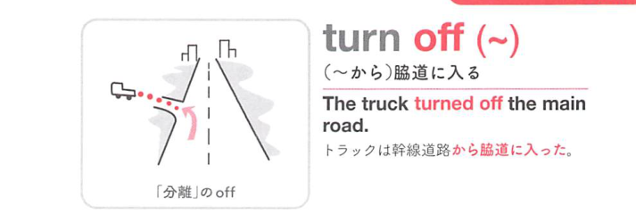
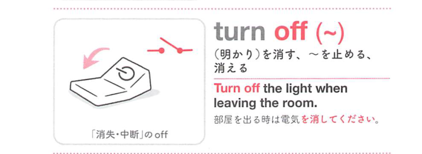

### 連想

turn off ~ は「つまみやスイッチをオフの方向へ回す」イメージ。作動しているものを止める ⇒ 電気を消す、水・ガスを止める、となる。

### 類義語
- turn off
  - 電気、機械、水、ガスなどを止めることを表す
  - 自動詞で「明かりなどが消える」にもなる
- switch off
  - 「スイッチを切る」
  - turn off と近く、スイッチ操作の感じが強い
- shut off
  - 「止める、遮断する」
  - 水・ガス・電源などの供給を止める感じが強い
- put out
  - 「火や明かりを消す」
  - 火・たばこ・ランプなどに使いやすい

### 画像
<!-- 熟語に対応する画像 -->

<!-- 動詞に対応する画像 -->

<!-- 前置詞に対応する画像 -->

