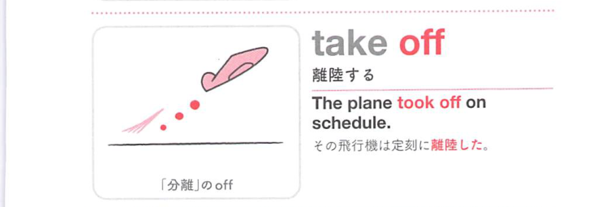
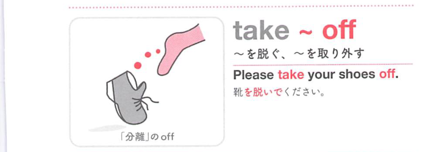
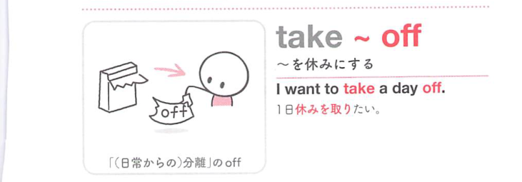
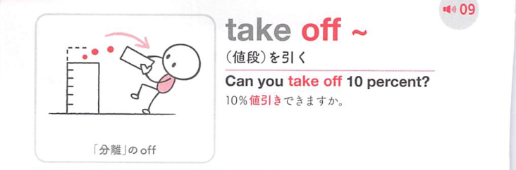

### 連想

take off ~ は「身についたものを取って離す」イメージ。服を脱ぐ、何かを取り除く、飛行機が地面から離れる、売上が急に離陸する、へ広がる。

### 類義語
- take off
  - 服を脱ぐ、取り除く、離陸する、急増する、休暇を取るなどに使う
  - 共通するのは「離れる」感覚
- remove
  - 「取り除く」
  - take off より硬く、服以外にも広く使える
- undress
  - 「服を脱ぐ」
  - 脱衣そのものに焦点がある
- have off
  - 「休みとして取る」
  - take a day off と近く、休暇の意味に使う

### 画像
<!-- 熟語に対応する画像 -->

<!-- 動詞に対応する画像 -->

<!-- 前置詞に対応する画像 -->

