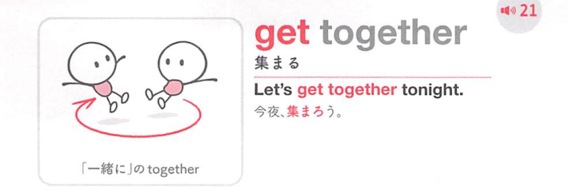
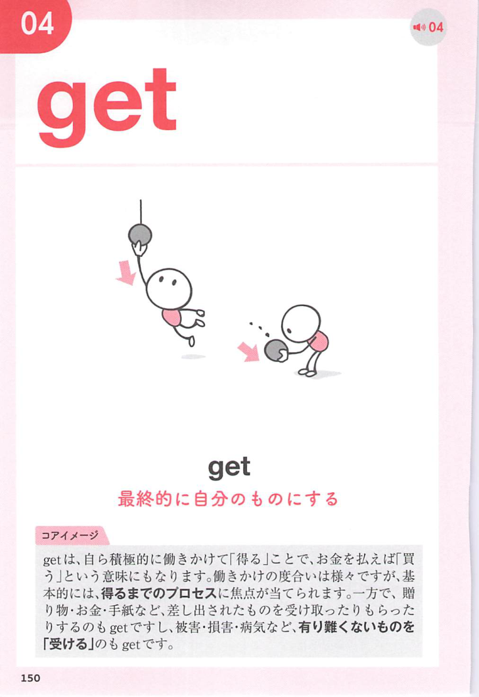
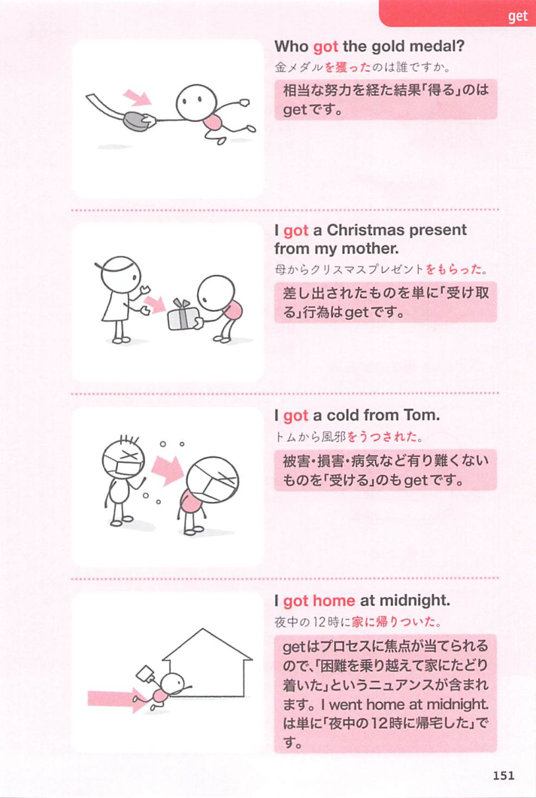
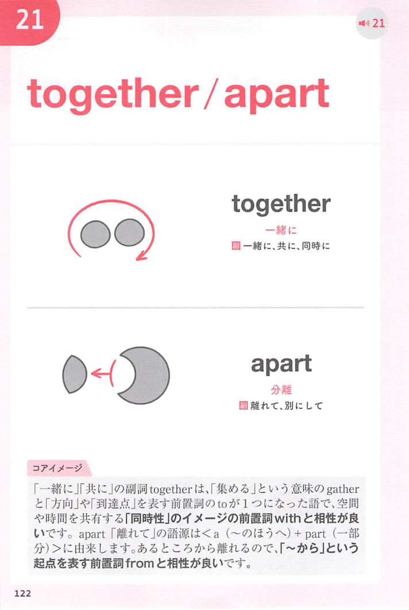
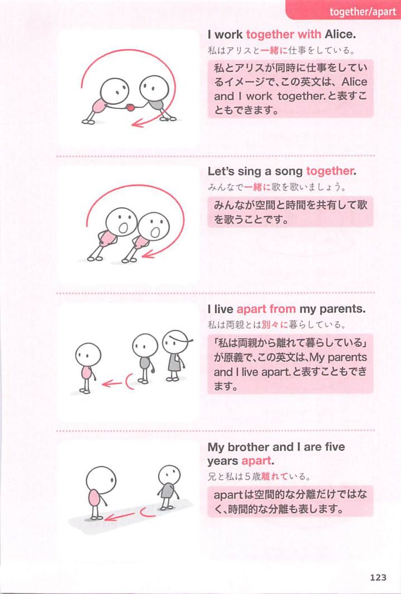

### 連想

get together は「別々のものが一緒になる」イメージ。人が一か所に寄る ⇒ 集まる。物や人を一緒にする ⇒ 集める、となる。

### 類義語
- get together
  - 人が集まる、または人や物を集めることを表す
  - くだけた集まりにも使いやすい
- gather
  - 「集まる、集める」
  - get together より少し中立的・硬め
- meet
  - 「会う、集まる」
  - 人と会うことに焦点がある
- assemble
  - 「集合する、組み立てる」
  - 公式な集まりや部品の組み立てに使う硬めの語

### 画像
<!-- 熟語に対応する画像 -->

<!-- 動詞に対応する画像 -->

<!-- 前置詞に対応する画像 -->

