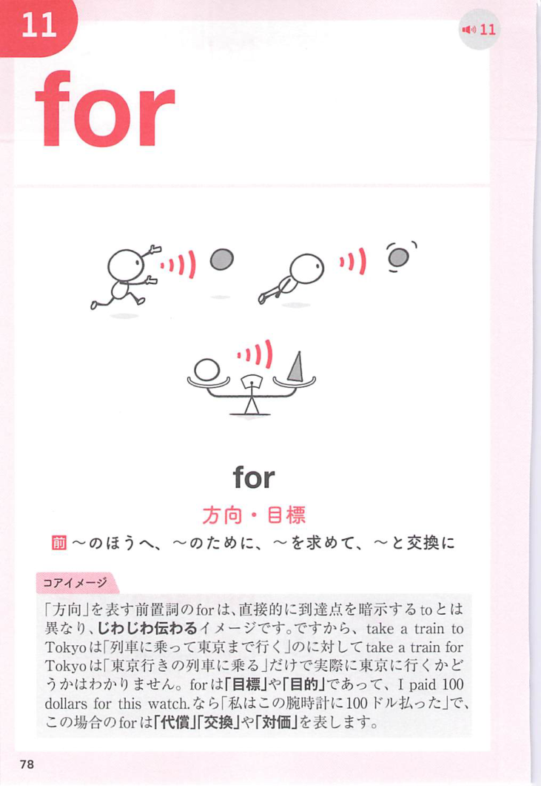
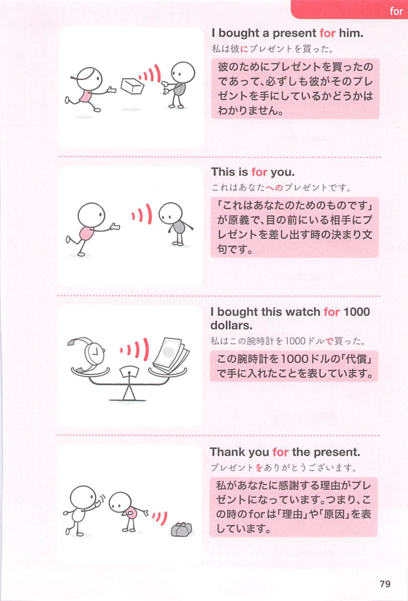

### 連想

ask for ~ は「〜を求めて尋ねる」イメージ。ただ質問するのではなく、相手に何かを求める ⇒ 〜を求める、となる。

### 類義語
- ask for
  - 助け、許可、物、情報などを求める
  - for が「求める対象」を示す
- request
  - 「要請する」
  - ask for より硬く丁寧
- demand
  - 「要求する」
  - 強く求める感じがあり、圧力がある
- seek
  - 「求める」
  - 助言や解決策など抽象的なものにも使う硬めの語

### 画像
<!-- 熟語に対応する画像 -->

<!-- 前置詞に対応する画像 -->

