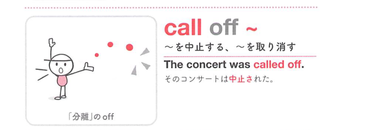

### 連想

call off ~ は「呼びかけて離れさせる」イメージ。予定されていた行事や計画を止める方向へ呼び戻す ⇒ 中止する、取り消す、となる。

### 類義語
- call off
  - 予定、試合、会議などを中止・取り消す
  - すでに予定されていたものに使いやすい
- cancel
  - 「取り消す、中止する」
  - 最も一般的な語
- postpone
  - 「延期する」
  - 中止ではなく後日にずらす
- abandon
  - 「放棄する」
  - 計画を完全にやめる感じが強い

### 画像
<!-- 熟語に対応する画像 -->

<!-- 前置詞に対応する画像 -->

