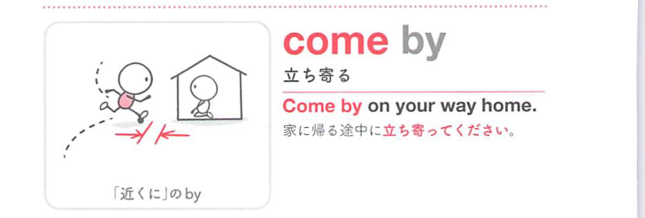
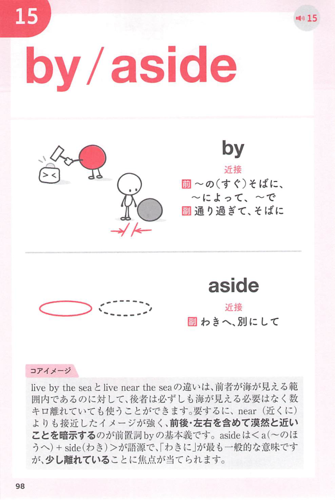
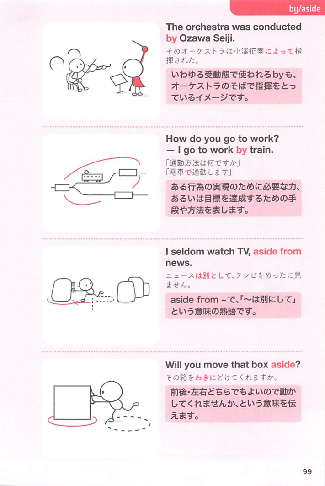

### 連想

come by ~ は「〜のそばまで来て手にする」イメージ。簡単ではないものを何とか得る ⇒ 〜を手に入れる、となる。

### 類義語
- come by
  - 物や情報を手に入れることを表す
  - hard to come by で「手に入りにくい」
- get
  - 「得る、手に入れる」
  - 最も一般的
- obtain
  - 「入手する」
  - get より硬く、正式な取得に使う
- acquire
  - 「獲得する」
  - 時間や努力をかけて得る感じがある

### 画像
<!-- 熟語に対応する画像 -->

<!-- 動詞に対応する画像 -->

<!-- 前置詞に対応する画像 -->

