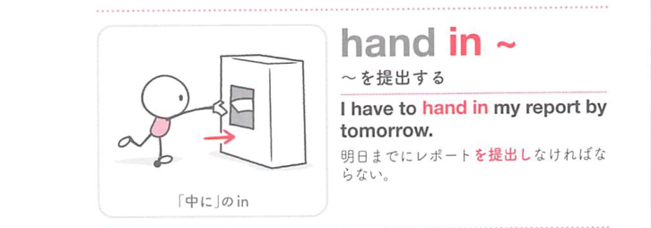

### 連想

hand in ~ は「手で中へ渡し入れる」イメージ。課題や書類を相手・提出先に渡す ⇒ 提出する、届ける、となる。

### 類義語
- hand in
  - 宿題、レポート、書類などを提出する
  - 手渡しの感覚がある
- submit
  - 「提出する」
  - 公式・電子提出にも使える硬めの語
- turn in
  - 「提出する」
  - 米語で宿題などに使いやすい
- give in
  - 「屈する、提出する」
  - 提出の意味では文脈が限られるので注意

### 画像
<!-- 熟語に対応する画像 -->

<!-- 動詞に対応する画像 -->

<!-- 前置詞に対応する画像 -->

