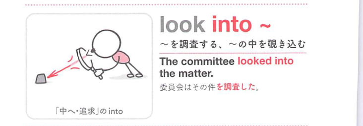

### 連想

look into ~ は「〜の中をのぞき込む」イメージ。表面だけでなく中身を調べる ⇒ 〜を調べる、となる。

### 類義語
- look into
  - 問題、事件、原因などを調べる
  - 詳しく確認する感じがある
- investigate
  - 「調査する」
  - 公式・本格的な調査に使う
- examine
  - 「調べる、検査する」
  - 対象を詳しく見る感じ
- check
  - 「確認する」
  - look into より軽い

### 画像
<!-- 熟語に対応する画像 -->

<!-- 動詞に対応する画像 -->

<!-- 前置詞に対応する画像 -->

