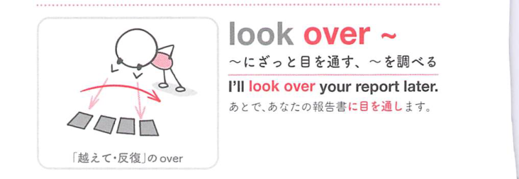
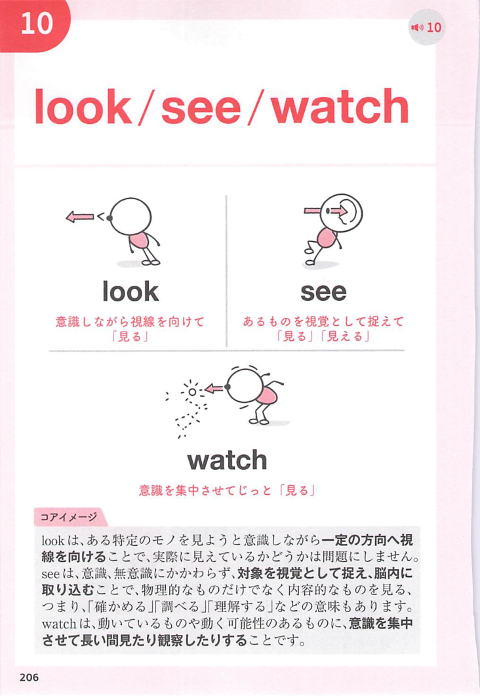
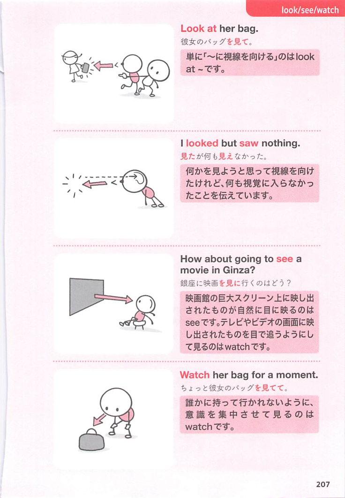
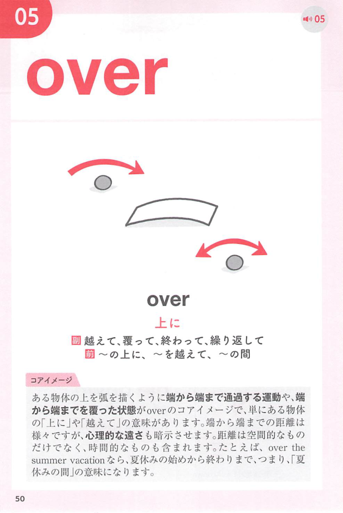
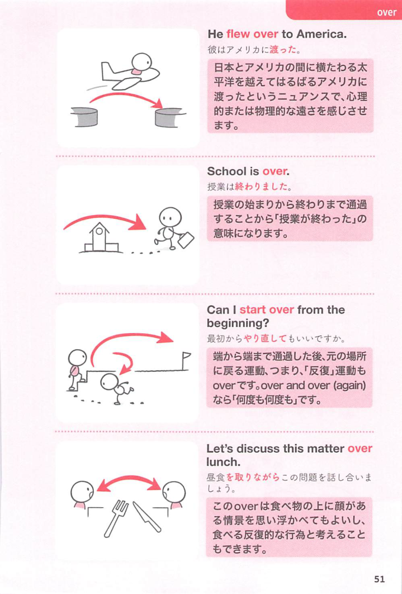

### 連想

look over ~ は「〜の上をざっと見る」イメージ。全体に目を通して確認する ⇒ ざっと調べる、となる。

### 類義語
- look over
  - 書類や物をざっと見て確認する
  - 詳細な調査より全体チェック
- examine
  - 「詳しく調べる」
  - look over より丁寧で細かい
- review
  - 「見直す、確認する」
  - 内容を評価・確認する感じ
- skim
  - 「ざっと読む」
  - 文章を細部まで読まずに見る

### 画像
<!-- 熟語に対応する画像 -->

<!-- 動詞に対応する画像 -->

<!-- 前置詞に対応する画像 -->

