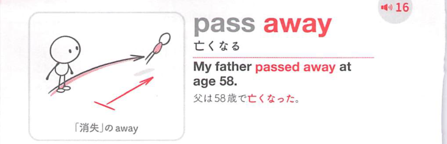

### 連想

pass away は「この世から過ぎ去る」イメージ。die を直接言わず柔らかく表す ⇒ 亡くなる、となる。

### 類義語
- pass away
  - 「亡くなる」という婉曲表現
  - die より柔らかく丁寧
- die
  - 「死ぬ」
  - 直接的で中立的
- pass on
  - 「亡くなる」
  - pass away と同じく婉曲的
- lose one's life
  - 「命を落とす」
  - 事故や災害などで使いやすい

### 画像
<!-- 熟語に対応する画像 -->

<!-- 動詞に対応する画像 -->

<!-- 前置詞に対応する画像 -->

