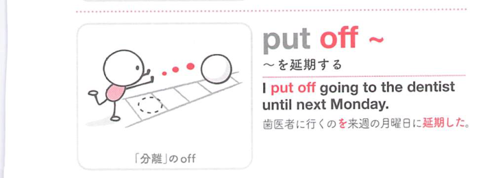

### 連想

put off ~ は「離れたところに置く」イメージ。今やる予定を先のほうへ離して置く ⇒ 延期する、となる。

### 類義語
- put off
  - 予定や行動を後回しにする・延期する
  - 日常的でよく使う
- postpone
  - 「延期する」
  - put off より硬く、公式な予定に使いやすい
- delay
  - 「遅らせる」
  - 開始や進行が遅れることに焦点がある
- defer
  - 「延期する、先送りする」
  - 硬い表現で、決定や支払いにも使う

### 画像
<!-- 熟語に対応する画像 -->

<!-- 動詞に対応する画像 -->

<!-- 前置詞に対応する画像 -->

