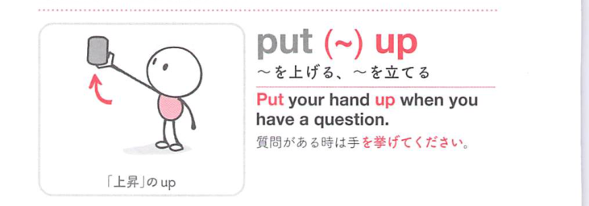
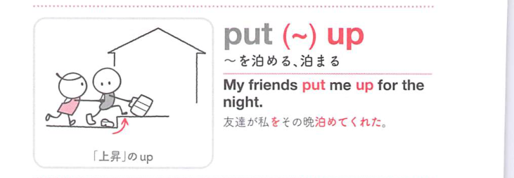
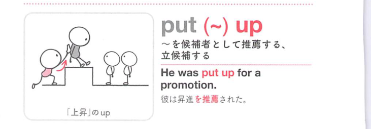

### 連想

put up ~ は「上に置く・上げる」イメージ。掲示物を上げる、建物を建てる、旗を掲げる。さらに人を家に泊める意味にも広がる。

### 類義語
- put up
  - 掲げる、上げる、建てる、泊めるなど幅広く使う
  - 共通するのは「上げる・立てる・受け入れる」感覚
- raise
  - 「上げる、掲げる」
  - 位置を上に動かす
- erect
  - 「建てる、直立させる」
  - 建造物などに使う硬めの語
- accommodate
  - 「宿泊させる、収容する」
  - put up の「泊める」に近い硬い表現

### 画像
<!-- 熟語に対応する画像 -->

<!-- 動詞に対応する画像 -->

<!-- 前置詞に対応する画像 -->

