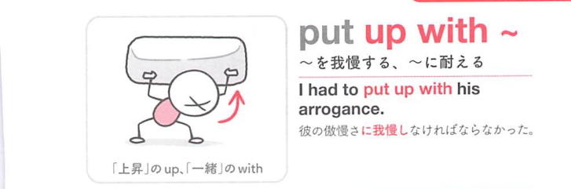

### 連想

put up with ~ は「嫌なものを上に置いたまま耐える」イメージ。不快な状況を取り除けず抱えておく ⇒ 我慢する、となる。

### 類義語
- put up with
  - 不快な人・状況・音などを我慢する日常表現
  - しぶしぶ耐える感じがある
- tolerate
  - 「許容する、我慢する」
  - put up with より硬く、中立的
- endure
  - 「耐える」
  - 苦痛や困難を長く耐える感じが強い
- stand
  - 「我慢する」
  - 否定文で I can't stand it. のようによく使う

### 画像
<!-- 熟語に対応する画像 -->

<!-- 動詞に対応する画像 -->

<!-- 前置詞に対応する画像 -->

