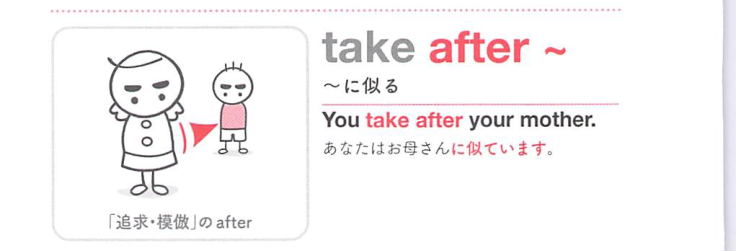
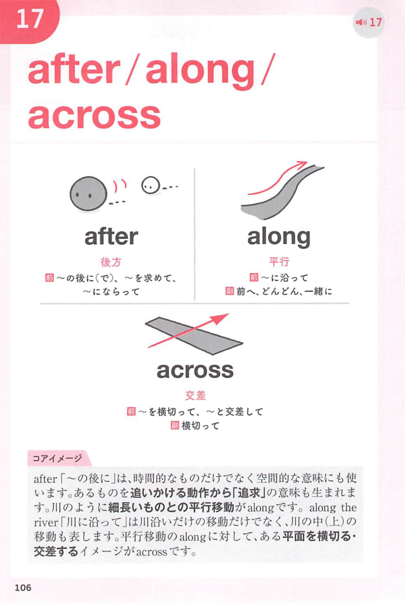
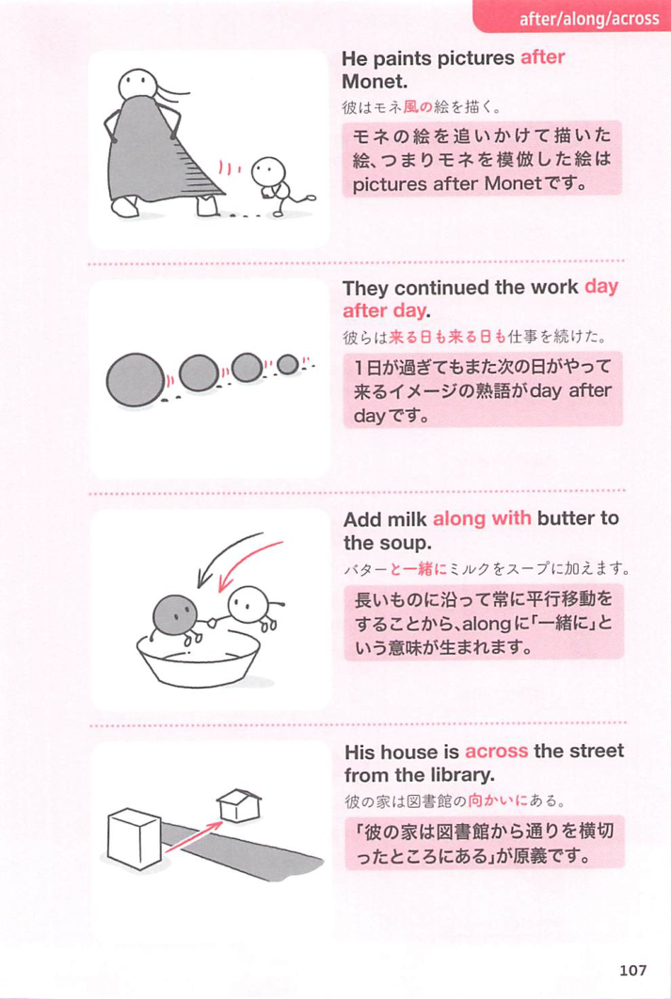

### 連想

take after ~ は「〜の後を取る」イメージ。親や親族の後ろ姿・性質を受け継ぐように見える ⇒ 〜に似ている。

### 類義語
- take after
  - 主に親族に似ているときに使う
  - 外見だけでなく性格や才能にも使える
- resemble
  - 「似ている」のやや硬い表現
  - 人にも物にも使える
- look like
  - 外見が似ていることに焦点がある

### 画像
<!-- 熟語に対応する画像 -->

<!-- 動詞に対応する画像 -->

<!-- 前置詞に対応する画像 -->

