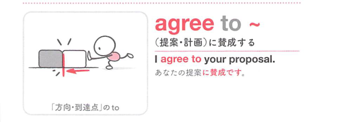
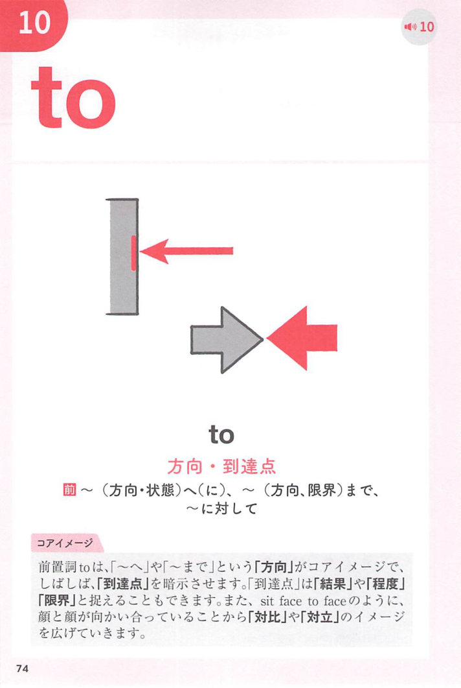
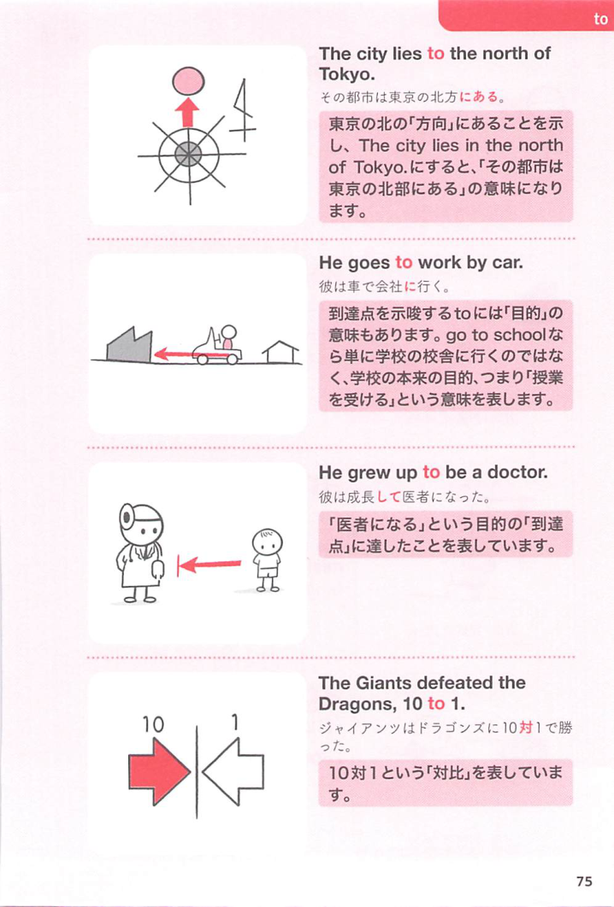

### 連想

agree to ~ は「提案や条件のところへ同意して進む」イメージ。相手の案を受け入れる ⇒ 提案・条件などに同意する。

### 類義語
- agree to
  - 提案・計画・条件を受け入れる
  - 人ではなく内容に同意する
- consent to
  - 「同意する、承諾する」
  - 公式・法的な響き
- accept
  - 「受け入れる」
  - 同意して受け取る感じ

### 画像
<!-- 熟語に対応する画像 -->

<!-- 前置詞に対応する画像 -->

