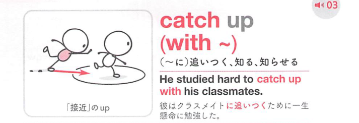

### 連想

catch up with ~ は「遅れた位置から追いついて捕まえる」イメージ。前にいる人や水準に並ぶ ⇒ 追いつく。

### 類義語
- catch up with
  - 遅れを取り戻して追いつく
  - 人・水準・仕事に使える
- catch up to
  - 主に米語で同じ意味
  - 移動や進度に使いやすい
- keep up with
  - 遅れずについていく
  - 追いついた後の維持に焦点

### 画像
<!-- 熟語に対応する画像 -->

<!-- 前置詞に対応する画像 -->

