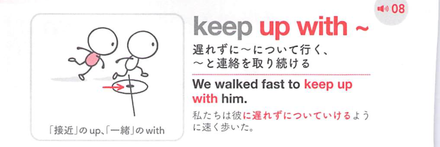

### 連想

keep up with ~ は「〜と同じ高さ・速さを保つ」イメージ。置いていかれないようについていく ⇒ 遅れずについていく。

### 類義語
- keep up with
  - 人・変化・流行・仕事に遅れずついていく
  - 日常的で幅広い
- keep pace with
  - 同じ歩調を保つ硬めの表現
  - 進歩や速度に焦点
- catch up with
  - 遅れた状態から追いつく

### 画像
<!-- 熟語に対応する画像 -->

<!-- 動詞に対応する画像 -->

<!-- 前置詞に対応する画像 -->

