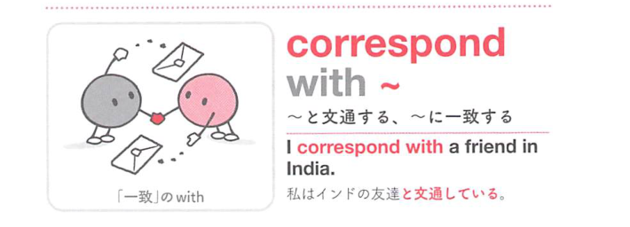

### 連想

correspond with ~ は「手紙などで互いに対応し合う」イメージ。やりとりを交わす ⇒ 文通する、連絡を取り合う。

### 類義語
- correspond with
  - 手紙やメールでやりとりする
  - やや古風・硬め
- communicate with
  - 「〜と連絡を取る」
  - 手段を問わず広い
- write to
  - 「〜に手紙を書く」
  - 一方向の動作に焦点

### 画像
<!-- 熟語に対応する画像 -->

<!-- 前置詞に対応する画像 -->

