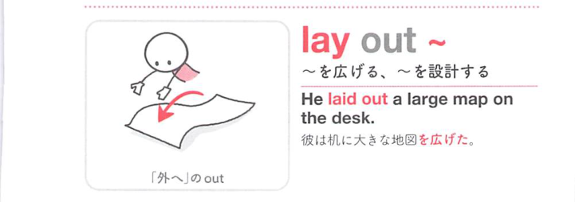
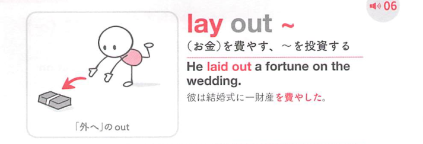

### 連想

lay out ~ は「外に広げて置く」イメージ。物を並べる、設計図を広げる ⇒ 並べる、設計する。

### 類義語
- lay out
  - 物を配置する、計画や設計を示す
  - 全体の配置に焦点
- set out
  - 「並べる、説明する」
  - 順序立てて示す感じ
- arrange
  - 「配置する、整える」
  - 整理された並びに焦点

### 画像
<!-- 熟語に対応する画像 -->

<!-- 前置詞に対応する画像 -->

