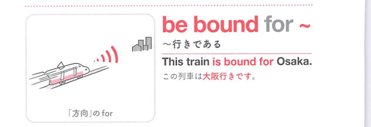

### 連想

be bound for ~ は「〜へ向かうように縛られている」イメージ。目的地が決まっている ⇒ 〜行きである。

### 類義語
- be bound for
  - 列車・船・人などが目的地へ向かっている
  - 目的地を硬めに示す
- be headed for
  - 「〜へ向かっている」
  - 日常的で幅広い
- be going to
  - 「〜へ行く」
  - 最も一般的

### 画像
<!-- 熟語に対応する画像 -->

<!-- 前置詞に対応する画像 -->

