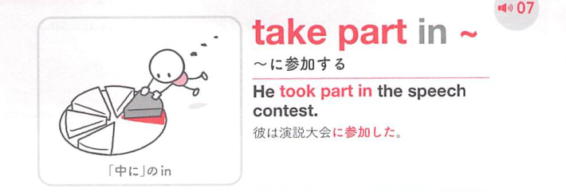

### 連想

take part in ~ は「活動の一部分を取る」イメージ。全体の中で自分の役割を持つ ⇒ 〜に参加する。

### 類義語
- take part in
  - 活動・行事・議論に参加する
  - 役割を持って関わる感じ
- participate in
  - 硬めの「参加する」
  - 公式文書に合う
- join in
  - 途中から一緒に加わる感じ

### 画像
<!-- 熟語に対応する画像 -->

<!-- 動詞に対応する画像 -->

<!-- 前置詞に対応する画像 -->

