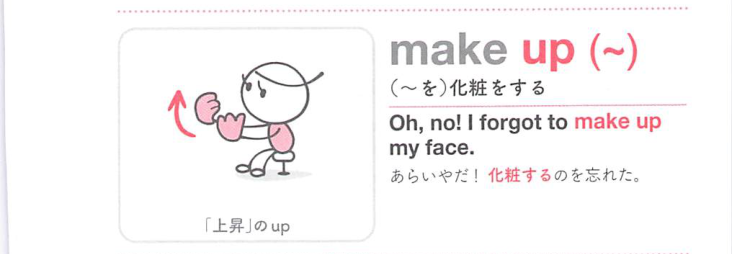
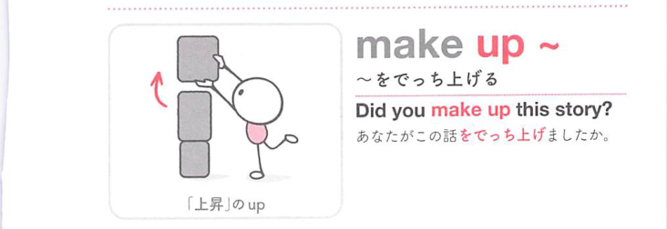
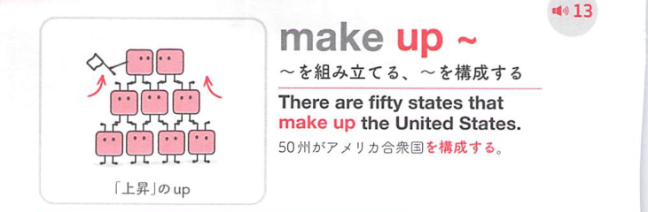
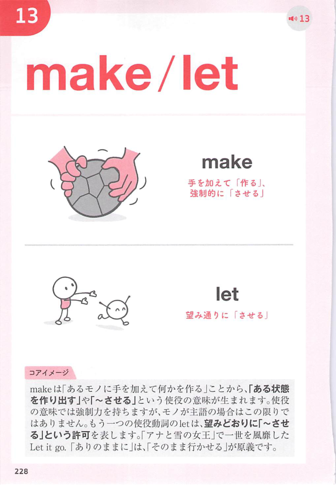
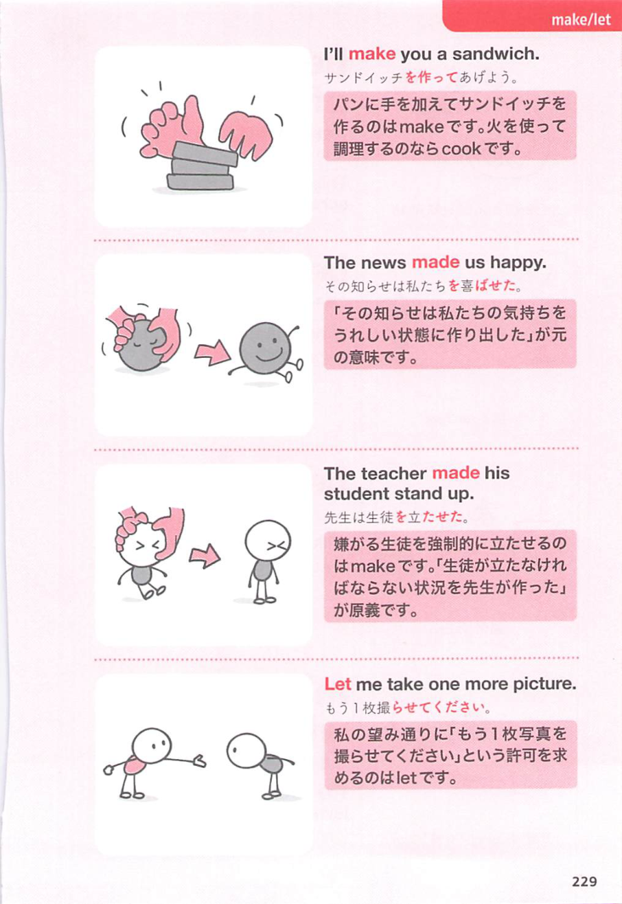

### 連想

make up は「足りないものを作って全体にする」イメージ。構成する、作り上げる、仲直りする、埋め合わせる、へ広がる。

### 類義語
- make up
  - 構成する、作る、仲直りする、埋め合わせるなど文脈で変わる
  - 「不足を満たして整える」感覚が共通
- constitute
  - 「構成する」
  - 硬い表現
- make up for
  - 「埋め合わせる」
  - 不足や損失を補う

### 画像
<!-- 熟語に対応する画像 -->

<!-- 動詞に対応する画像 -->

<!-- 前置詞に対応する画像 -->

