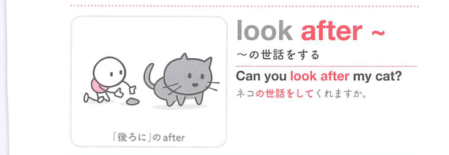

### 連想

look after ~ は「〜の後ろから見守る」イメージ。相手の状態を見て面倒を見る ⇒ 〜の世話をする。

### 類義語
- look after
  - 子ども・病人・物などの世話をする
  - 見守る感じがある
- take care of
  - 世話や対応をする一般表現
  - 責任を持つ感じ
- care for
  - 世話をする、気にかける

### 画像
<!-- 熟語に対応する画像 -->

<!-- 動詞に対応する画像 -->

<!-- 前置詞に対応する画像 -->

