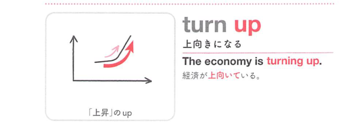
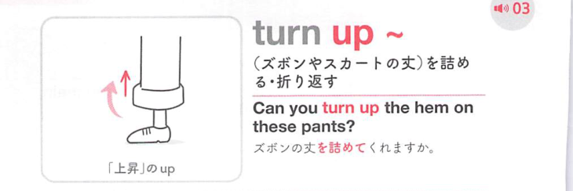
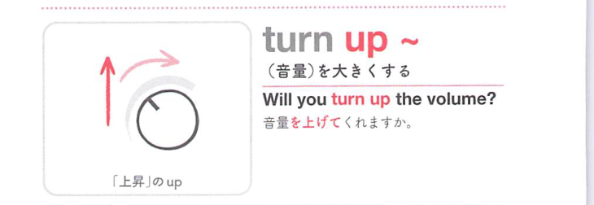
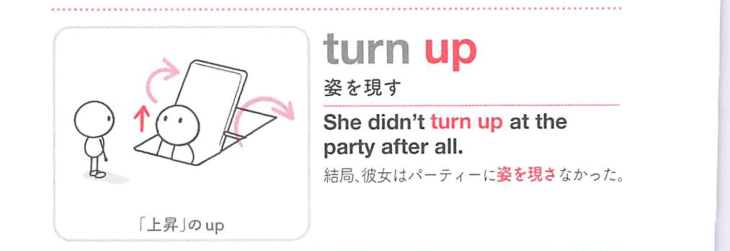

### 連想

turn up は「上に向いて現れる」イメージ。人や物がひょっこり出る、音量を上げる、探し出す、へ広がる。

### 類義語
- turn up
  - 現れる、起こる、音量などを上げる、見つかる
  - 文脈で意味を判断する
- show up
  - 予定場所に現れる
  - 人に使いやすい
- increase
  - 音量などを大きくする意味に近い

### 画像
<!-- 熟語に対応する画像 -->

<!-- 動詞に対応する画像 -->

<!-- 前置詞に対応する画像 -->

