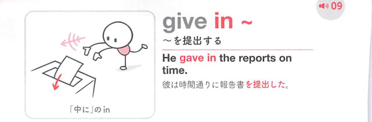
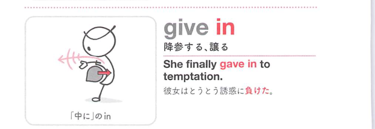

### 連想

give in は「抵抗を差し出して中へ引っ込める」イメージ。相手に屈する。また物を提出先へ渡し入れる意味にもなる。

### 類義語
- give in
  - 屈服する、または提出する
  - to を付けると屈する相手を示す
- surrender
  - 「降伏する」
  - 強い屈服
- hand in
  - 提出する
  - give in の提出の意味に近い

### 画像
<!-- 熟語に対応する画像 -->

<!-- 動詞に対応する画像 -->

<!-- 前置詞に対応する画像 -->

