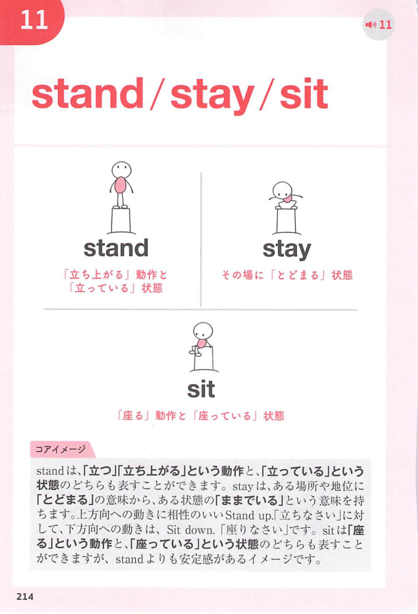

### 連想

stand out は「外へ立っている」イメージ。周囲から飛び出して見える ⇒ 際立つ、目立つ。

### 類義語
- stand out
  - 周囲より目立つ、際立つ
  - 良い意味にも悪い意味にも使える
- be noticeable
  - 「目につく」
  - 中立的
- be outstanding
  - 「非常に優れている」
  - 良い意味が強い

### 画像
<!-- 熟語に対応する画像 -->

<!-- 動詞に対応する画像 -->

<!-- 前置詞に対応する画像 -->

