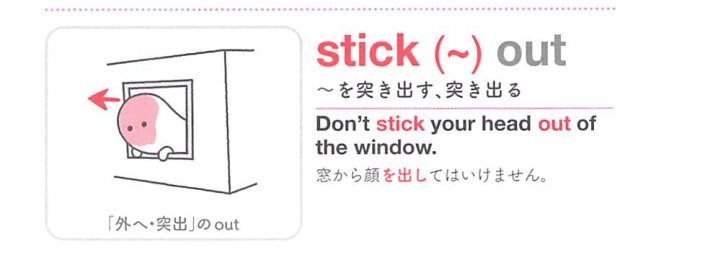

### 連想

stick out は「外へ突き出る」イメージ。物理的に出っぱる、または周囲から浮いて目立つ ⇒ 突き出る、目立つ。

### 類義語
- stick out
  - 物が突き出る、または悪目立ちする
  - stand out より物理的・違和感の感じがある
- protrude
  - 「突き出る」
  - 硬い表現
- stand out
  - 「際立つ」
  - 良い意味にも使いやすい

### 画像
<!-- 熟語に対応する画像 -->

<!-- 前置詞に対応する画像 -->

