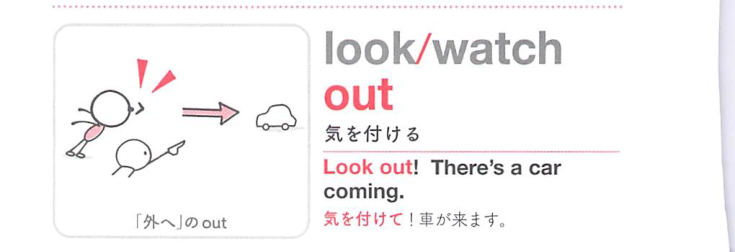
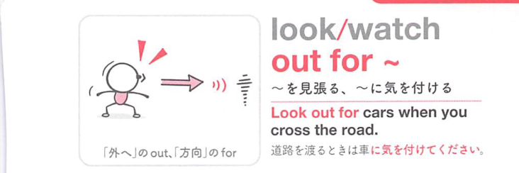

### 連想

look out for ~ は「外を見て危険や対象に備える」イメージ。注意して探す・警戒する ⇒ 気をつける。

### 類義語
- look out for
  - 危険や人・物に注意を向ける
  - 警戒と探す感じがある
- watch out for
  - より口語的な「気をつける」
  - 危険への注意が強い
- be careful about
  - 一般的な「注意する」

### 画像
<!-- 熟語に対応する画像 -->

<!-- 動詞に対応する画像 -->

<!-- 前置詞に対応する画像 -->

