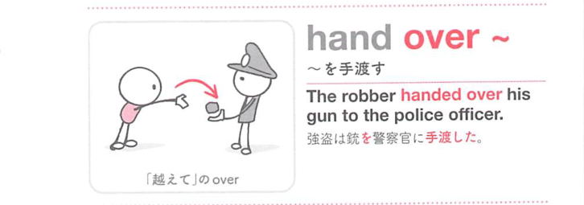
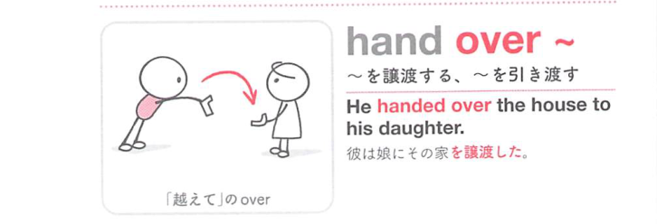
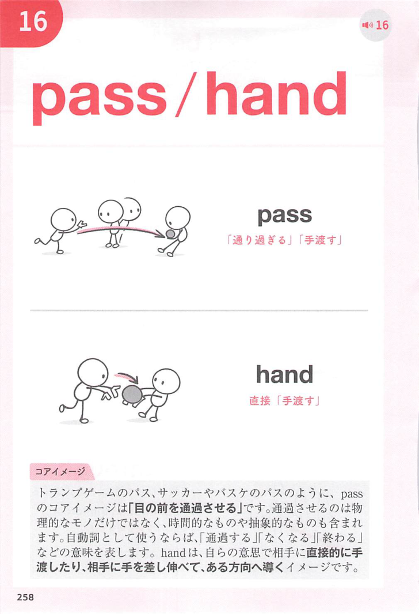
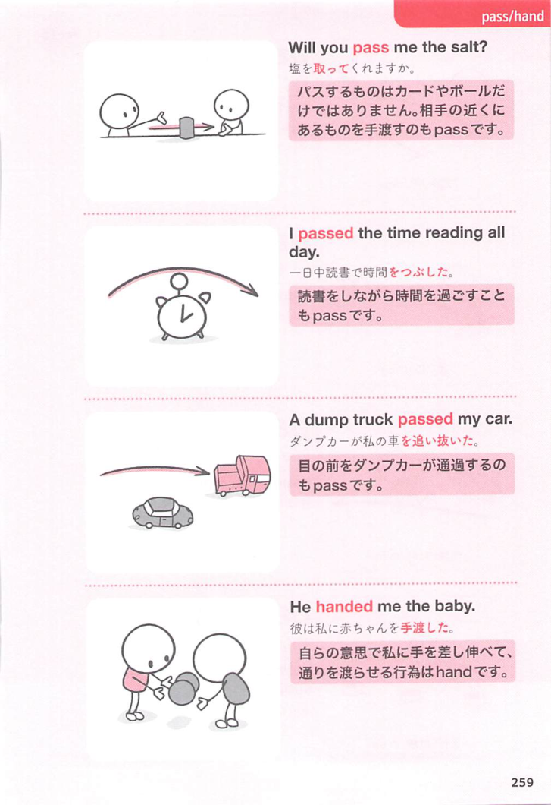

### 連想

hand over ~ は「手から相手の側へ渡す」イメージ。権限や物を相手に移す ⇒ 引き渡す、手渡す。

### 類義語
- hand over
  - 物・権限・犯人などを引き渡す
  - 所有や管理が移る感じ
- hand in
  - 書類などを提出する
  - 提出先へ渡す
- turn over
  - 権限や物を引き渡す意味でも使う

### 画像
<!-- 熟語に対応する画像 -->

<!-- 動詞に対応する画像 -->

<!-- 前置詞に対応する画像 -->

