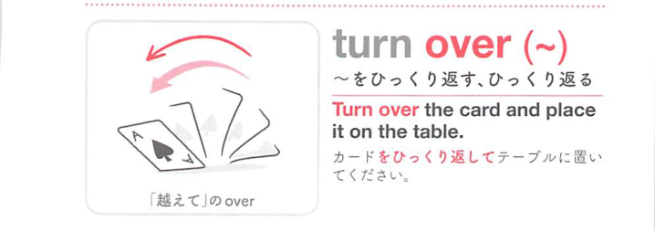
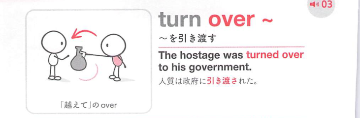

### 連想

turn over は「ひっくり返して別の面にする」イメージ。物を返す、ページをめくる、権限を相手へ渡す ⇒ 引き渡す、ひっくり返す。

### 類義語
- turn over
  - 引き渡す、譲る、ひっくり返す、ページをめくる
  - 「向きを変える」感覚が中心
- hand over
  - 「引き渡す」
  - 所有や管理の移動に焦点
- flip over
  - 「ひっくり返す」
  - 物理的な反転に使う

### 画像
<!-- 熟語に対応する画像 -->

<!-- 動詞に対応する画像 -->

<!-- 前置詞に対応する画像 -->

