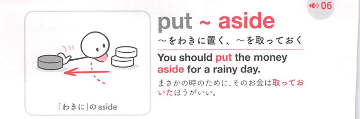
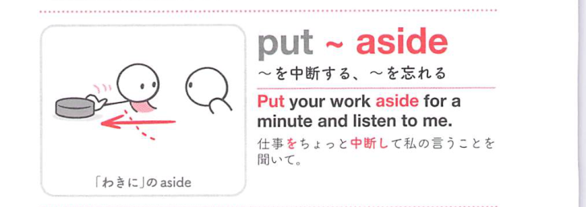

### 連想

put aside ~ は「脇へ置く」イメージ。今使わず取っておく、感情や問題を一時的に脇に置く ⇒ 取っておく、蓄える。

### 類義語
- put aside
  - 脇に置く、取っておく、蓄える
  - お金や時間にも使う
- set aside
  - 「取っておく、確保する」
  - 公式・計画的な響き
- save
  - 「保存する、蓄える」
  - 日常的

### 画像
<!-- 熟語に対応する画像 -->

<!-- 動詞に対応する画像 -->

<!-- 前置詞に対応する画像 -->

