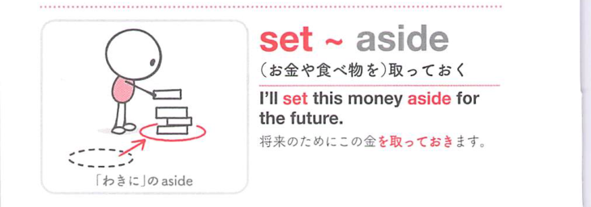

### 連想

set aside ~ は「別にして置いておく」イメージ。特定の目的のために確保する、または脇に置く ⇒ 蓄える、取っておく。

### 類義語
- set aside
  - 時間・金・場所を確保する、脇に置く
  - 目的のために分ける感じ
- put aside
  - 日常的な「取っておく」
  - 感情を脇に置く意味にも使う
- reserve
  - 「予約する、確保する」
  - 硬め

### 画像
<!-- 熟語に対応する画像 -->

<!-- 動詞に対応する画像 -->

<!-- 前置詞に対応する画像 -->

