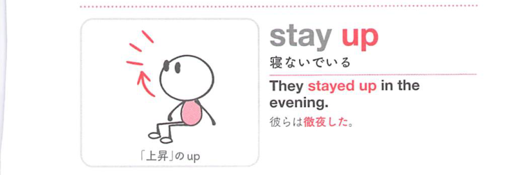

### 連想

stay up は「上の状態にとどまる」イメージ。眠りに下りず、起きた状態を保つ ⇒ 寝ないで起きている。

### 類義語
- stay up
  - 夜遅くまで寝ずに起きている
  - 日常的
- sit up
  - 起きている、上体を起こす
  - 姿勢の意味もある
- remain awake
  - 「起きたままでいる」
  - 説明的で硬い

### 画像
<!-- 熟語に対応する画像 -->

<!-- 動詞に対応する画像 -->

<!-- 前置詞に対応する画像 -->

