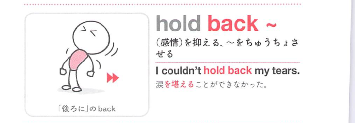

### 連想

hold back ~ は「後ろに押さえておく」イメージ。人を制止する、情報や感情を前に出さず隠す ⇒ 制止する、隠す。

### 類義語
- hold back
  - 制止する、隠す、感情を抑える
  - 前へ出る力を止める感じ
- keep back
  - 「隠す、制止する」
  - hold back と近い
- restrain
  - 「抑制する」
  - 硬い表現

### 画像
<!-- 熟語に対応する画像 -->

<!-- 動詞に対応する画像 -->

<!-- 前置詞に対応する画像 -->

