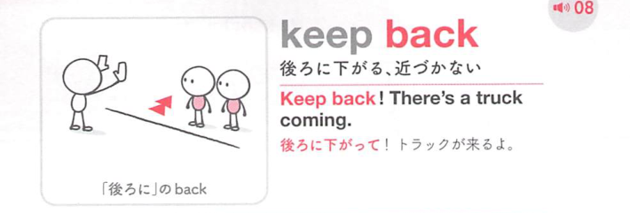
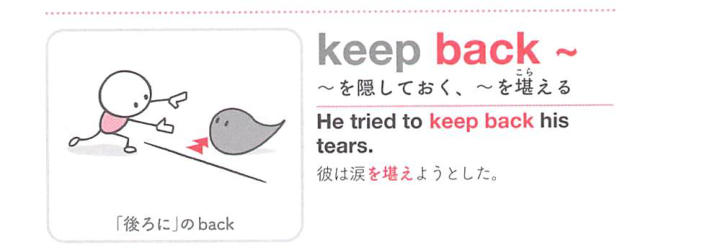
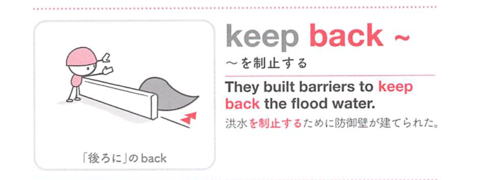

### 連想

keep back ~ は「後ろに保って前へ出さない」イメージ。真相を隠す、人や物を制止する ⇒ 隠す、制止する。

### 類義語
- keep back
  - 情報・感情・人を前に出さない
  - 隠す意味に使いやすい
- hold back
  - 制止する、隠す
  - より一般的
- conceal
  - 「隠す」
  - 硬く、意図的な隠蔽

### 画像
<!-- 熟語に対応する画像 -->

<!-- 動詞に対応する画像 -->

<!-- 前置詞に対応する画像 -->

