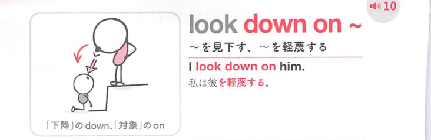

### 連想

look down on ~ は「上から下を見る」イメージ。相手を自分より低く見る ⇒ 〜を見下す。

### 類義語
- look down on
  - 人を軽蔑して見下す
  - upon を使うとやや硬い
- despise
  - 「軽蔑する」
  - 強い否定的感情
- disrespect
  - 「尊重しない」
  - 態度に焦点

### 画像
<!-- 熟語に対応する画像 -->

<!-- 動詞に対応する画像 -->

<!-- 前置詞に対応する画像 -->

